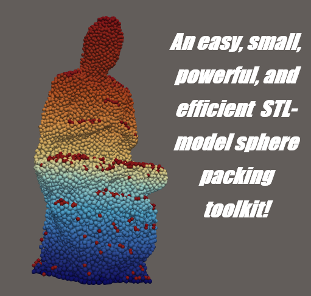

**Haven't finished the User guide.** Contact me at:

**hustler_lee@sjtu.edu.cn**

Backup mails:

2938304843@qq.com,

bohzan@yandex.ru.

It's easier to use the recommended faster branch in C++ language:

`main-cpp`

Dependences for MATLAB version:
---
Ray/Triangle Intersection version 1.0 (https://uk.mathworks.com/matlabcentral/profile/authors/1927554-jesus-p-mena-chalco)
Stl volume calculation versio 1.0 (https://uk.mathworks.com/matlabcentral/fileexchange/26982-volume-of-a-surface-triangulation) 
You need to going to the file, modify the definition of the function `rayTriangleIntersection` by adding another argument myEps (as the last) and set: `epsilon = myEps`.
stlTools version 1.1 (https://uk.mathworks.com/matlabcentral/profile/authors/402762-pau-mico)

References:
---
Li, Naiping, et al. "An efficient dense spheres packing method in complex domains for 3D DEM simulations." Powder Technology (2026): 122583.

Zhang, Duan Z., et al. "Rapid particle generation from an STL file and related issues in the application of material point methods to complex objects." Computational Particle Mechanics 11.5 (2024): 2291-2305.

Haeri, Sina. "Optimisation of blade type spreaders for powder bed preparation in Additive Manufacturing using DEM simulations." Powder Technology 321 (2017): 94-104.